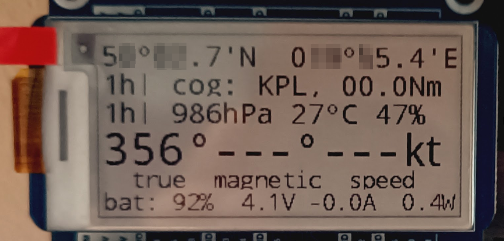

# rpi-openploter-tools
Various openplotter helper scripts.
Please follow the waveshare wiki instructions for installation of dependencies

# The hardware
- raspberry pi 4
- waveshare environment sensor hat https://www.waveshare.com/wiki/Environment_Sensor_HAT
- waveshare ups hat https://www.waveshare.com/wiki/UPS_HAT_(D)
- waveshare e-paper 2.13 hat https://www.waveshare.com/wiki/2.13inch_e-Paper_HAT

# The software
- raspi os / debian bookworm
- opencpn
- signalk

